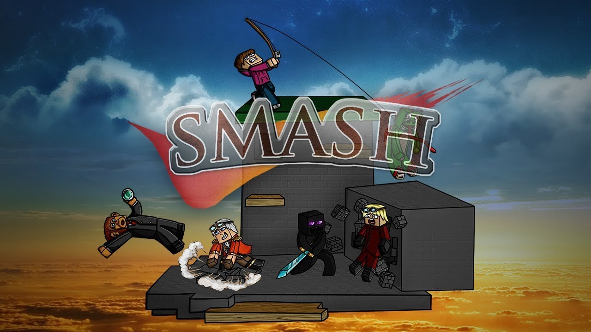

# SCSmash

SMASH, Shotbow sunucusunun 2013'ten beri geliştirdiği Minecraft oyunudur. Bizde bu 7 yıldır değişmeyen zevki Türkiye'ye getirdik.

SMASH oyunundaki amaç haritadaki tüm oyuncuları vurup devirmek ve ayakta kalan son kişi olmaktır. SMASH, gelişmiş sunucu tarafı eklentilerini kullanarak, oyuncuların bir sunucu tarafı modunda daha önce hiç görülmemiş şeyleri yapmasını sağlar. Çifte zıplayın, özel bir SMASH saldırısı kullanın, çeşitli ölümcül silahlar kullanın ve haritayı çılgın patlayıcılarla veya rakiplerinizi duvarlara fırlatarak yok edin. Ancak dikkatli olun, zorlu özel öğeler ve özel yetenekler size savaşta yardımcı olmak için haritada ortaya çıkacak, hayatta kalmak kolay olmayacak!

.png>)


[oegrenim.md](oegrenim.md)



[oezel-esyalar.md](oezel-esyalar.md)


