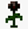

# Özel eşyalar

### Silahlar

Silahlar doğrudan hasar işinde çok etkilidir ve aynı zamanda birden çok kullanıma sahiplerdir.

|                                                                      Eşya                                                                     |    Eşya ismi    |                                                      Özelliği                                                      |                      Kullanım sayısı                      | Çıkma şansı |
| :-------------------------------------------------------------------------------------------------------------------------------------------: | :-------------: | :----------------------------------------------------------------------------------------------------------------: | :-------------------------------------------------------: | :---------: |
|           |   Tahta kılıç   |                                    Karşı saldırıda verdiği hasar 8-12% arasıdır.                                   |                             4                             |      10     |
|           |  Yaldızlı Kılıç |                                    Karşı saldırıda verdiği hasar 8-12% arasıdır.                                   |                             4                             |      7      |
|              |    Taş kılıç    |                                   Karşı saldırıda verdiği hasar 10-15% arasıdır.                                   |                             4                             |      5      |
|                 |   Parlak kılıç  |                                   Karşı saldırıda verdiği hasar 12-18% arasıdır.                                   |                             4                             |      3      |
|        |   Elmas kılıç   |                                   Karşı saldırıda verdiği hasar 14-21% arasıdır.                                   |                             4                             |      1      |
|                       |   Parçalayıcı   |                  Sol tık ile vurduğun bölgeyi havayı uçurur. İçinde oyuncu varsa 200% hasar verir.                 |                             1                             |      1      |
|                                         |       Yay       |                                              Ok başına 20 hasar verir.                                             |                             15                            |      4      |
|        |   Over'ın yayı  |                                      Çoklu ok atar, ok başına 20 hasar verir.                                      |                             3                             |      3      |
|              |  Over'ın oltası |                         Oltayla tuttuğun oyuncuyu çektiğinde hasarı kadar sana doğru uçar.                         | 
3 (Oyuncu çekersen)

32 

(Boşa atarsan)
 |      5      |
|   |   Over'ın gülü  | Sağ tık ile ateşli top fırlatır, değdiği yer yanar, eğer oyuncuya değerse oyuncu 33% hasar alır ve yanmaya başlar. |                             5                             |      5      |
|  | Roket fırlatıcı |     Sağ tık ile roket fırlatır, çarptığı yerde patlama oluşturur ve alanda bulunan oyunculara %70 hasar verir.     |                             1                             |      2      |
|           |  Füze bataryası |                Sağ tık ile 12 tane minyatür roket yollar, çok az blok hasarı ve geri itmesi vardır.                |                             1                             |      2      |

### Tuzaklar

Tuzaklar genellikle çeşitli efektlerle fırlatılan nesnelerdir. Yanlış kullanılırsa atıcıya da zarar verebilir.

|                                                                 Eşya                                                                 |  Eşya ismi  |                                                        Özelliği                                                        | Kullanım sayısı | Çıkma şansı |
| :----------------------------------------------------------------------------------------------------------------------------------: | :---------: | :--------------------------------------------------------------------------------------------------------------------: | :-------------: | :---------: |
|                                |   Buz küpü  |     Eşyayı sağ tık ile fırlattıktan sonra düştüğü bölgedeki oyunculara 3 saniye sonra 8 saniyelik yavaşlatma verir.    |        1        |      4      |
|  | Tuzak Mayın |      Eşyayı sağ tık ile fırlattıktan 3 saniye sonra düştüğü bölgeye tuzağı kurar ve basan kişiye %100 hasar verir.     |        1        |      5      |
|                                                       | Yarasa şoku | Eşyayı sağ tık ile baktığı yönde yarasa çıkarır ve 5 saniye boyunca yarasa kör edici flash ile yanar. Ardından patlar. |        1        |      8      |
|     |  El bombası |             Eşyayı sağ tık ile fırlattıktan 2 saniye sonra düştüğü bölgeyi havaya uçurur %100 hasar verir.             |        1        |      6      |

### Yardımcılar

Yardım eşyaları kullanıcısına yardımcı olmak için tasarlanmıştır. Hasar yüzdelerini düşürerek ya da rakiplerine üstünlük sağlayarak onlara avantaj sağlar

|                                                                               Eşya                                                                              |      Eşya ismi     |                                                Özelliği                                               | Kullanım sayısı | Çıkma şansı |
| :-------------------------------------------------------------------------------------------------------------------------------------------------------------: | :----------------: | :---------------------------------------------------------------------------------------------------: | --------------- | :---------: |
|                                                     |      Adrenalin     |                         Sağ tıklanarak kullanıldığında 30 saniye hız 2 verir.                         | 1               |      5      |
|                                      |     Işınlayıcı     |                                 Baktığın yönde 22 blok ileri ışınlar.                                 | 1               |      8      |
|  | Şişe içinde bulut. |               Boş bir alanda 3x3 plaform oluşturur. 2 saniyede bir bu platform bozulur.               | 1               |      3      |
|                 |       Jetpack      |                                 Yukarı çıkman için itme gücü uygular.                                 | 4               |      3      |
|                                                        |        Yemek       |                                   Hasar yüzdeni %10 olarak düşürür.                                   | 1               |      5      |
|                          |     Garip çorba    |                                   Hasar yüzdeni %100 olarak düşürür.                                  | 1               |      3      |
|                                               |  Harita yenileyici |                                         Tüm haritayı yeniler.                                         | 1               |      1      |
|                |    Ekstra hayat    | Sağ tık ile kullanıldığında 5 saniye boyunca hareketsiz kalmanız durumunda size ekstra bir can ekler. | 1               |      1      |
|                                   |    Gölge yürüyüş   |                                        4 saniye görünmez yapar.                                       | 1               |      5      |
